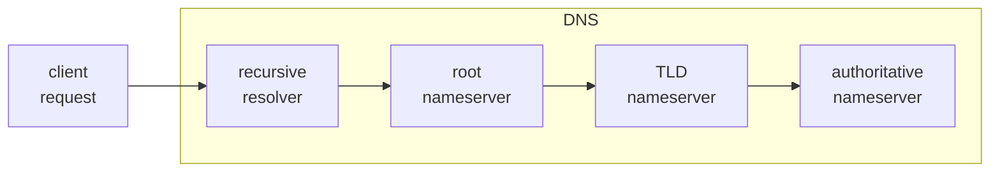

> The Domain Name System (DNS) is the phonebook of the Internet. Humans access information online through domain names, like nytimes.com or espn.com. Web browsers interact through Internet Protocol (IP) addresses. DNS translates domain names to IP addresses so browsers can load Internet resources.

<cite>[What is DNS?](https://www.cloudflare.com/learning/dns/what-is-dns/)</cite>

When a browser requests a website such as https://www.example.com, it needs to find the _Internet protocol_ (<abbr title="Internet protocol">IP</abbr>) address of the server that hosts that site in order to establish a connection and load resources. It does this using the _domain name system_ (<abbr title="Domain name system">DNS</abbr>).

## Servers

A DNS lookup requires 4 servers to locate the <abbr title="Internet protocol">IP</abbr> address of the requested domain name:

1. **Recursive resolver:** takes the client request and recursively makes additional requests on the client's behalf.
2. **Root nameserver:** points the resolver to the correct <abbr title="Top-level domain">TLD</abbr> nameserver.
3. **<abbr title="Top-level domain">TLD</abbr> nameserver:** points the resolver to the authoritative nameserver for the hostname.
4. **Authoritative nameserver:** returns the <abbr title="Internet protocol">IP</abbr> address of the target server to the resolver.



## Example

Using the _dig_ [[/notes/command-line-tool/|command-line tool]], we can trace a <abbr title="Domain name system">DNS</abbr> query to `example.com`.

```sh
$ dig example.com +trace

.                       193735  IN      NS      m.root-servers.net.
com.                    172800  IN      NS      j.gtld-servers.net.
example.com.            172800  IN      NS      elliott.ns.cloudflare.com.
example.com.            277     IN      A       172.66.147.243
example.com.            277     IN      A       104.20.23.154
```
