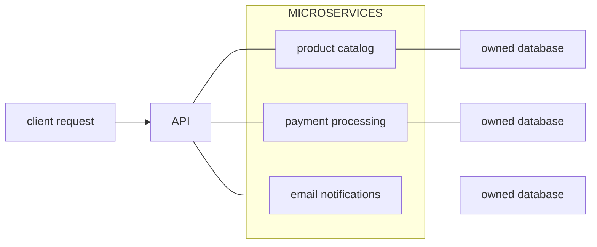

In software architecture, microservices refers to codebases where application capabilities are separated into individually bundled and deployed units. Microservices typically have a slower setup velocity than other architectures, such as [[/notes/monolith/|monolith]], due to requiring more infrastructure, but can mitigate organisational bottlenecks like multi-team coordination.

## Example

An e-commerce platform with three key features: product catalog, payment processing, email notifications. Each feature is its own standalone application with its own database. Services communicate with one another via <abbr title="Application programming interface">API</abbr> systems such as <abbr title="Representational state transfer">REST</abbr>.

