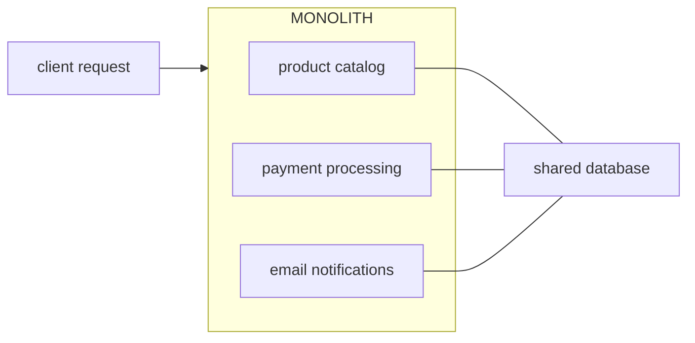

In software architecture, monolith refers to codebases where all application capabilities are bundled and deployed in a single unit. Monoliths typically have a faster setup velocity than other architectures, such as [[/notes/microservices/|microservices]], due to requiring less infrastructure, but can be subject to organisational bottlenecks like multi-team coordination.

## Example

An e-commerce platform with three key features: product catalog, payment processing, email notifications. Each feature exists in the application and share a single database. Services communicate with one another directly.

