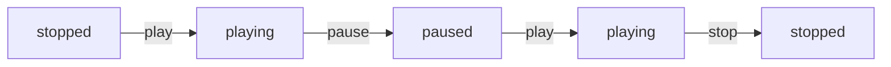

A finite state machine (<abbr title="Finite state machine">FSM</abbr>) is a behavioural model for keeping track of the "state" of an application at any given moment. While <abbr title="Finite state machine">FSM</abbr> is a conceptual computer science model, it can be implemented with the "state" behavioural [[/notes/design-pattern/|design pattern]].

## Example

A media player application with 3 states. In each state, an action transitions the application from the current state to a new state.

1. **stopped:** transitions to **playing**
2. **playing:** transitions to **paused** or **stopped**
3. **paused:** transitions to **playing**

